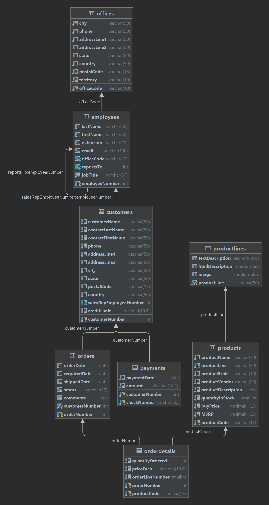

# Training Junior Programmer 4

1. Pelajari modul Transaction SQL , Normalization, dan SQL Subquery.
2. Untuk sample database menggunakan week sebelumnya. (https://www.mysqltutorial.org/mysql-sample-database.aspx)
3. Melakukan Transaction SQL 
   1. Insert untuk 5 record & commited.
   2. Insert/update/delete di 1 sesi dan read table di sesi yg berbeda. 
   3. Rollback ke savepoint.
4. Membuat table struktur dari form yang disediakan
5. Eksekusi script sql subquery pada modul training:
   1. SELECT statement
   2. INSERT statement
   3. UPDATE statement
   4. DELETE statement
   5. Filter dari column dengan agregasi nilai paling besar
   6. Query dari Subquery sebagai source data
   7. Combine query UNION 
   8. Combine query INTERSECT
6. Upload script dan screenshot task ke github masing-masing, create dalam bentuk issue.
7. Assign link github ke lokasi yang sudah disediakan
8. Submit!

Link Issue terkait : https://github.com/madwanz64/neuron-junior-programmer-4/issues/1

### Diagram
